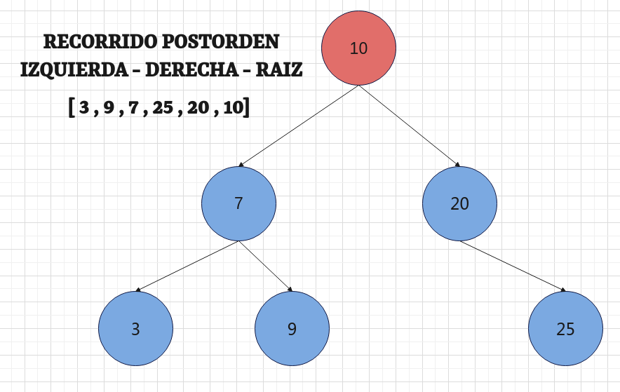
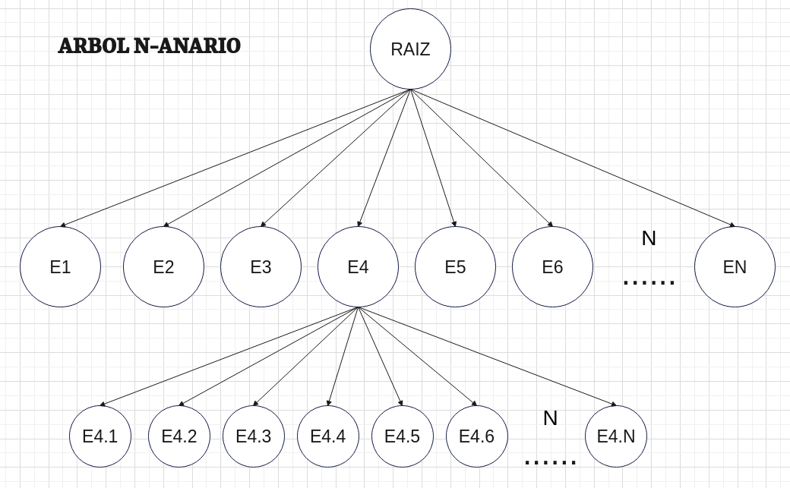
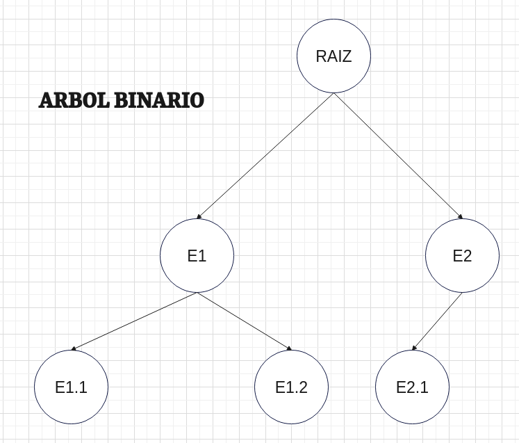
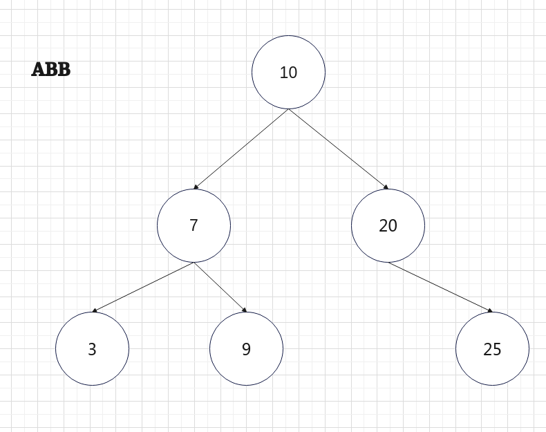
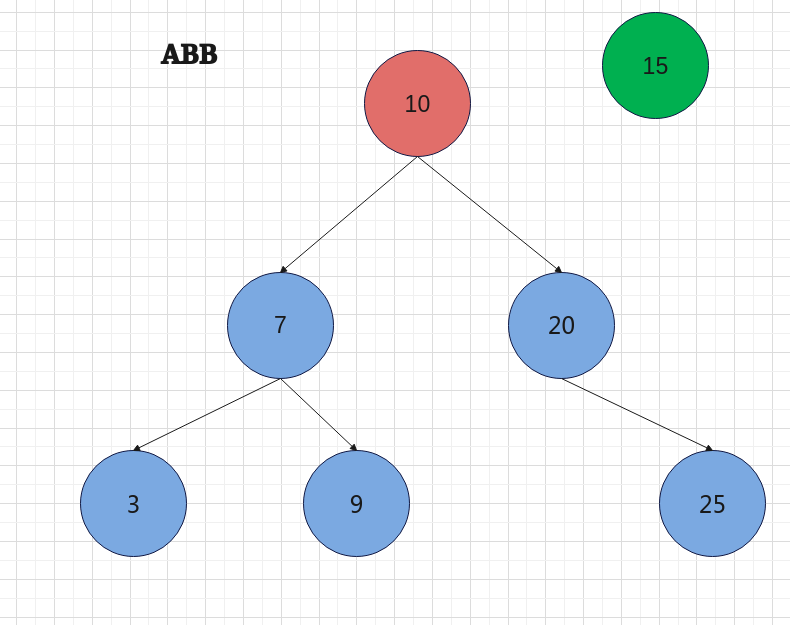
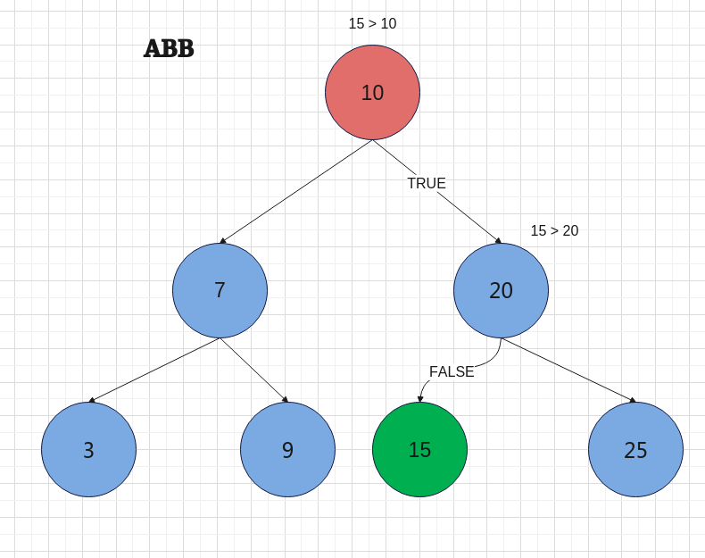
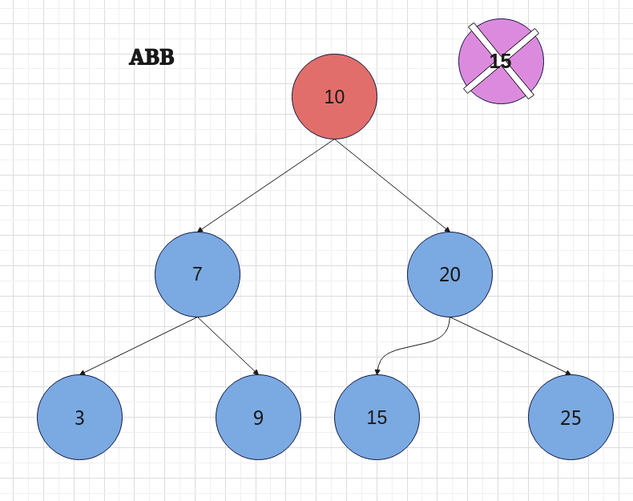
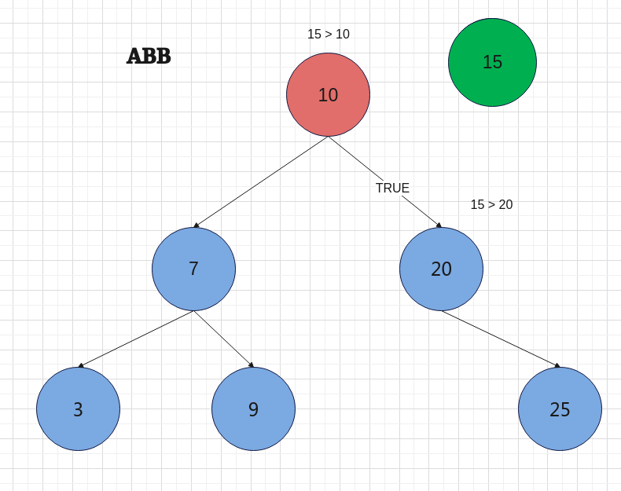
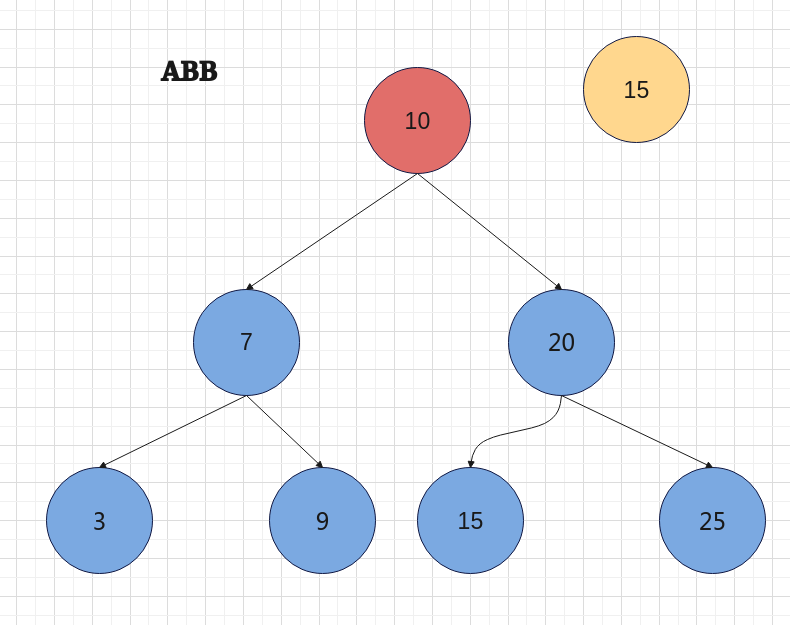
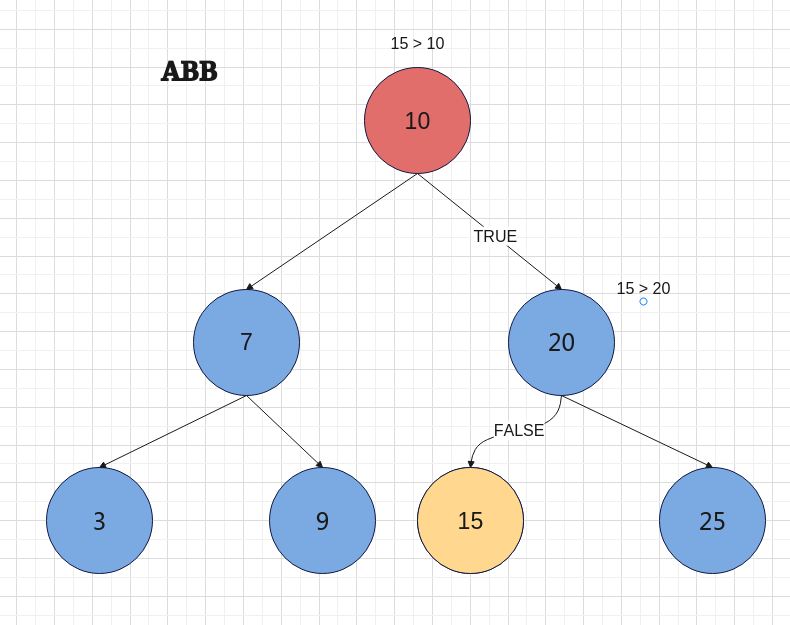

<div align="right">

</div>

# TDA ABB

## Alumno: Ivan Emanuel Fabregat - 112287 - ifabregat@fi.uba.ar

# **Comandos**

- Para compilar:

```bash
gcc -o tp_abb tp_abb.c src/abb.c src/split.c src/csv.c 
```

- Para ejecutar:

```bash
./tp_abb ejemplos/pokedex.csv
```

- Para ejecutar con valgrind:
```bash
valgrind ./tp_abb ejemplos/pokedex.csv
```

---

### (R) Recursivo - (C) Ciclo

#  Funciones basicas

* **abb_crear**: asigna memoria con `calloc` para la estructura de `abb`. Si recibe un una función de comparación la asigna al campo `comparador` sino devuelve `NULL`. Devuelve el `abb` si pudo asignar memoria, caso contrario `NULL`.

* **abb_destruir** **(R)**: llama a `abb_destruir_todo` pero con la función `destructor` como `NULL`.

* **abb_destruir_todo** **(R)**: llama a la función `nodo_destruir` pasándole como primer nodo la `raiz`. Una vez dentro comienza toda la *recursividad* para el recorrido del árbol. Empieza con el `izquierdo` y se fija si es `NULL` y `retorna`. Cuando llegue al ultimo nodo (viendo de arriba hacia abajo) se encargara de aplicar la función `destructor` al nodo.

* **abb_insertar** **(R)**: asigna al campo `raíz` el nodo devuelto de la función `nodo_insertar`. Esta función verá si el nodo pasado (**raiz**) es `NULL`, si lo es llama a la función `nodo_crear` que se encargar de asignar memoria a la estructura `nodo_t` y asigna el `elemento` pasado al campo. Una vez tenida la raíz, en las próximas llamadas usará la funcion `comparador` ver si corresponde hacer el mismo procedimiento pero esta vez pasando como nodo el `nodo derecho` o `nodo izquierdo`. A su vez se estará usando un `bool` para comprobar que se haya agregado y así poder sumar uno a la cantidad de nodos. Devuelve `True` si lo pudo insertar, caso contrario `False`.

* **abb_quitar** **(C)**: se encarga de eliminar el elemento deseado. Para eso comienza creando un nodo auxiliar. Hará un bucle hasta que encuentre el nodo o no haya mas nodos. Realiza una comparación si da 0 encontró el nodo a eliminar y habrá distintos casos de eliminación. Caso contrario dependiendo de la comparación cambia el nodo a comparar. Devuelve `True` si pudo, caso contrario `False`.

    1. No tenga hijos (solo la raíz): simplemente elimina el elemento. Si este es la raíz, la asigna como `NULL` caso contrario, se ajusta al puntero del `nodo padre` para que sea `NULL`.
    2. Solo hijo derecho: simplemente se asigna al `hijo derecho` como nuevo sucesor. Si esta es la raíz se asigna como nueva raíz al `hijo derecho`.
    3. Solo hijo izquierdo: simplemente se asigna al `hijo izquierdo` como nuevo sucesor. Si esta es la raíz se asigna como nueva raíz al `hijo izquierdo`.
    4. Tenga ambos hijos: va a buscar el nodo mas grande dentro del subárbol izquierdo. Se lo reemplazara y se ajustaran las conexiones dentro del subárbol izquerdo.
    
* **abb_obtener** **(C)**: mediante un bucle recorre el árbol. Por el resultado de la comparación recorrerá para un lado o para el otro. Devuelve el elemento si lo encontró, caso contrario `NULL`.

* **abb_cantidad**: devuelve el campo `cantidad`.


# Funciones de iteración

**IMPORTANTE**: para desarrollar estas tres funciones cada una llama a su función `recursiva`. Las funciones principales pasaran como parámetros:  `nodo`, `f`, `ctx`, `&contador` y `&continuar`. De los cuales el mas importante que cambie es el `nodo` ya que indica a que lado seguirá.

* **abb_iterar_inorden_r** **(R)**: recorre el árbol con el siguiente sentido `hijo izquierdo` después `padre` y por ultimo `hijo derecho`. Se encargara de aplicar la función `f` e irá sumando uno al contador por cada vez que se llama de forma recursiva. Si en algún momento la función `f` da `False` corta totalmente las llamadas recursivas. 

<div align="center">

</div>

* **abb_iterar_preorden_r** **(R)**: recorre el árbol con el siguiente sentido `padre` después `hijo izquierdo` y por ultimo `hijo derecho`. Se encargara de aplicar la función `f` e irá sumando uno al contador por cada vez que se llama de forma recursiva. Si en algún momento la función `f` da `False` corta totalmente las llamadas recursivas. 

<div align="center">

</div>

* **abb_iterar_postorden_r** **(R)**: recorre el árbol con el siguiente sentido `hijo izquierdo` después `hijo derecho` y por ultimo `padre`. Se encargara de aplicar la función `f` e irá sumando uno al contador por cada vez que se llama de forma recursiva. Si en algún momento la función `f` da `False` corta totalmente las llamadas recursivas. 

<div align="center">

</div>


# Funciones de vectorizar


**IMPORTANTE** **(R)**: para desarrollar esta parte implemente una estructura `vector_t` la cual contendrá un `void **` para el elemento y dos `size_t` uno para el tamaño y el otro para el contador.

* **guardar_vector**: formatea a `ctx` para que se comporte como tipo `vector_t`. Permitiendo guardar el elemento en la posición adecuada e incrementar el campo `contador`.

* **abb_vectorizar_inorden****(R)**: asigna a `ctx` los valores del vector, tamaño y el valor 0. Procede a llamar a la función `abb_iterar_inorden` pasándole como valores el `abb`, `guardar_vector` y la direccion de `ctx`. Devuelve el campo `contador` de `ctx`.

* **abb_vectorizar_preorden** **(R)**: asigna a `ctx` los valores del vector, tamaño y el valor 0. Procede a llamar a la función `abb_iterar_preorden` pasándole como valores el `abb`, `guardar_vector` y la direccion de `ctx`. Devuelve el campo `contador` de `ctx`.

* **abb_vectorizar_postorden** **(R)**: asigna a `ctx` los valores del vector, tamaño y el valor 0. Procede a llamar a la función `abb_iterar_postorden` pasándole como valores el `abb`, `guardar_vector` y la direccion de `ctx`. Devuelve el campo `contador` de `ctx`.


# Arboles diferencias y complejidades

**CONCEPTO**: es una estructura la cual nos permite almacenar grandes cantidades de datos. Pero reduciendo tiempo de de acceso a esta. Estos arboles contendrán su información en nodos. Pero el mas importante es el nodo `raíz` ya que todo comienza por ahí. Y después podrá tener o no muchos subárboles y esos subárboles podrán o no tener muchos subárboles también y así `n` veces.

<div align="center">

</div>

**TIPOS**

* **Arbol N-ario**: estos tipo de arboles tienen la raíz y pueden tener `n` cantidad de subárboles y a su vez esos `n` subárboles pueden tener `n` cantidad de surárboles y así sucesivamente. Hay que destacar que no tiene ninguna restricción, método de ordenamiento, etc.

* **Arbol binario**: estos tipos de arboles tienen la raíz y `solo` puede tener `2` subárboles y a su vez esos `2` subárboles solo pueden tener `2` subárboles cada uno. Este tendría una sola restricción y es que cada subárbol solo puede tener `2` ramificaciones (binario).

* **Arbol ABB**: estos tipos de arboles son idénticos a los arboles binarios. Pero la diferencia es en como quedan al final. Al momento de visualizar este árbol con los datos se vera que estarán ordenados. En forma de cascada según la raíz (en este tp) los datos mayores a la raíz irán a la derecha por el otro lado los menores.

<div align="center">


</div>

**Operaciones básicas**

**IMPORTANTE**: asumo que tanto los arboles N-arios como binarios no tienen orden de ordenamiento.

* **crear**: asignara memoria para la estructura. Complejidad -> O(1).

* **destruir**: se ira liberando elemento por elemento suponiendo que el árbol tiene `n` elementos. Complejidad -> O(n).

* **vacío**: suponiendo que la implementación tiene un campo con la cantidad de nodos. Otra manera de comprobarlo seria ver si la `raíz` (primer elemento) es distinto a `NULL`. Complejidad -> O(1).

* **insertar**
    1. N-ario: tendrá que recorrer los `n` elementos para llegar al ultimo elemento y agregar siguiente a ese. Complejidad -> O(n).
    2. Binario: tendrá que recorrer los `n` elementos para llegar al ultimo elemento y agregar siguiente a ese. Complejidad -> O(n).
    3. ABB: al seguir un criterio de orden este podría facilitar el recorrido para llegar a la posición a insertar. Complejidad -> O(log n) **MEJOR CASO** caso contrario O(n).
    
<div align="center">


<p>No necesitó recorrer todo el árbol, ya que en ABB hay un método de "ordenamiento"</p>
</div>
            
* **eliminar**
    1. N-ario: tendrá que recorrer los `n` elementos hasta llegar al elemento a eliminar. Complejidad -> O(n).
    2. Binario: tendrá que recorrer los `n` elementos hasta llegar al elemento a eliminar. Complejidad -> O(n).
    3. ABB: al seguir un criterio de orden este podría facilitar el recorrido al elemento a eliminar. Complejidad -> O(log n) **MEJOR CASO** caso contrario O(n).
    
<div align="center">


<p>No necesitó recorrer todo el árbol, ya que en ABB hay un método de "ordenamiento"</p>
</div>

* **buscar**
    1. N-ario: tendrá que recorrer los `n` elementos hasta llegar al elemento buscado. Complejidad -> O(n).
    2. Binario: tendrá que recorrer los `n` elementos hasta llegar al elemento buscado. Complejidad -> O(n).
    3. ABB: al seguir un criterio de orden este podría facilitar el recorrido al elemento buscado. Complejidad -> O(log n) **MEJOR CASO** caso contrario O(n).

<div align="center">


<p>No necesitó recorrer todo el árbol, ya que en ABB hay un método de "ordenamiento"</p>
</div>

* **recorrer**: suponiendo que el árbol tiene `n` cantidad de nodos tendrá que pasar por cada uno de ellos. Complejidad -> O(n)

# Dificultades

Escala de dificultad del 1 al 5, siendo 1 el nivel más fácil y 5 el más difícil.

* **abb_crear**: ☆ ☆ ☆ ☆ ☆ (0/5)

* **abb_destruir** **(R)**: ☆ ☆ ☆ ☆ ☆ (0/5)

* **abb_destruir_todo** **(R)**: ★ ★ ☆ ☆ ☆ (2/5) me costó la parte de pensar la parte recursiva.

* **abb_insertar** **(R)**: ★ ★ ★ ☆ ☆ (3/5) empecé bien la función recursiva de insertar, solo se me complico la idea de la función `nodo_crear`.

* **abb_quitar** **(C)**: ★ ★ ★ ★ ☆ (4/5) se me complico bastante la parte en la que si el nodo tenia `hijo derecho` como `hijo izquierdo`.
    
* **abb_obtener** **(C)**: ★  ☆ ☆ ☆ ☆ (1/5) simplemente no se complico tanto.

* **abb_cantidad**: ☆ ☆ ☆ ☆ ☆ (0/5)

* **abb_iterar_inorden** **(R)**: ★ ★ ★ ☆ ☆ (3/5) me costó identificar que parámetros le tendría que pasar a la función recursiva. 

* **abb_iterar_preorden** **(R)**: ★ ★ ★ ☆ ☆ (3/5) tenía una idea de la anterior solo fue cambiar el orden de la recursión.

* **abb_iterar_postorden** **(R)**: ★ ★ ★ ☆ ☆ (3/5) tenía una idea de la anterior solo fue cambiar el orden de la recursión.

* **abb_vectorizar_inorden** **(R)**: ★ ★ ★ ☆ ☆ (3/5) me costó la idea de como podría reutilizar la función `abb_iterar_inorden`.

* **abb_vectorizar_preorden** **(R)**: ★ ★ ★ ☆ ☆ (3/5) fue hacer lo mismo que la anterior pero llama a la función `abb_iterar_preorden`.

* **abb_vectorizar_postorden** **(R)**: ★ ★ ★ ☆ ☆ (3/5) fue hacer lo mismo que la anterior pero llama a la función `abb_iterar_postorden`.

